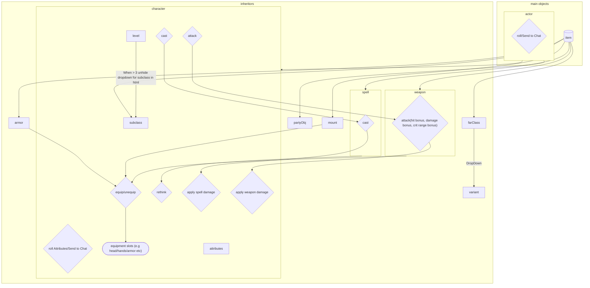

### far
# Test Build for LoF

## Steps towards playable state
# Equipment
# Base Classes
# Magic Spells
# Feats
# Abilities

## Future / Nice to have
# Subclasses
# Starter Class Pop up
# Helmet / Armor / Hand Equipment slots
# Consumables

