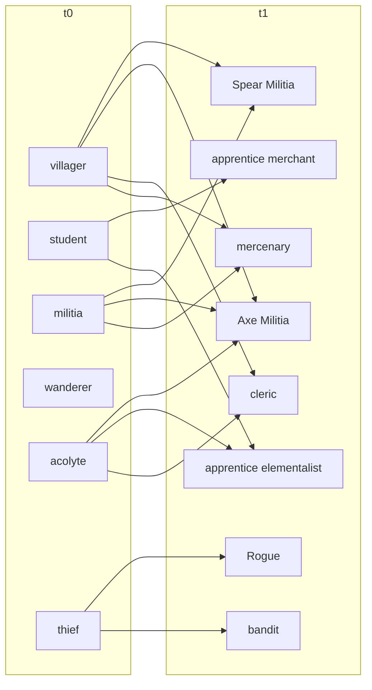

# Revision 3

A 0-X Player TTRPG designed for VTT campaigns with variable progression and class based characters

Players progress on a class tree that should something like

```mermaid
graph LR
subgraph t0
  villager
  student
  militia
  wanderer
  acolyte
  thief
end

subgraph t1
  merc1["mercenary"]
  cleric1["cleric"]
  bandit1["bandit"]
  elem1["apprentice elementalist"]
  merchant1["apprentice merchant"]
  axe1["Axe Militia"]
  spear1["Spear Militia"]
  rogue1["Rogue"]
end


villager --> merc1
militia --> merc1
militia --> axe1
militia --> spear1
villager --> cleric1
villager --> axe1
villager --> spear1
student --> elem1
student --> merchant1
acolyte --> cleric1
acolyte --> elem1
acolyte --> axe1
thief --> bandit1
thief --> rogue1


```
